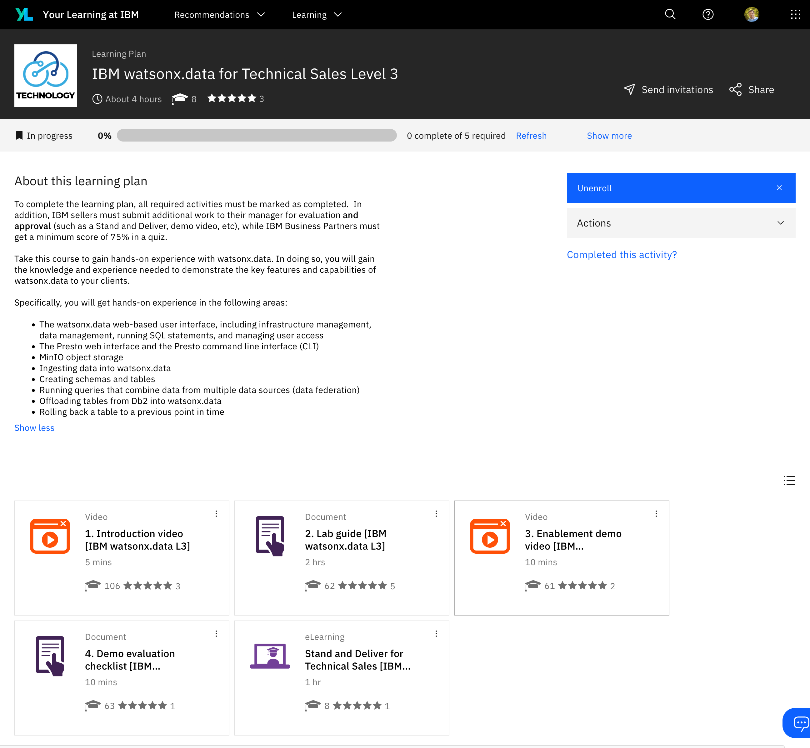

# Zusätzliches Material

**[Eine sehr gute Anleitung](https://ibm.seismic.com/Link/Content/DCG37pjmPj7VmGCHj2Df8fHVmDJj)** mit ausführlicheren Erklärungen und erweiterten Übungen wurde von Kelly Schlamb vorbereitet. Es ist Bestandteil vom als *learning plan* namens [IBM watsonx.data for Technical Sales Level 3](https://yourlearning.ibm.com/activity/PLAN-D1A3C14641E5) auf der **Your Learning at IBM Plattform** . Das ist sehr stark zu empfehlen, um ein tieferes Verständnis über die technischen Begriffe zu gewinnen, die wir im Workshop erläutern werden. 

??? tipp "Your Learning at IBM"

    Link zu den Kurs: <https://yourlearning.ibm.com/activity/PLAN-D1A3C14641E5>
        
    

Vorschau der Dokumentation:

<iframe width="100%" height="800" src="../media/kelly.pdf">

