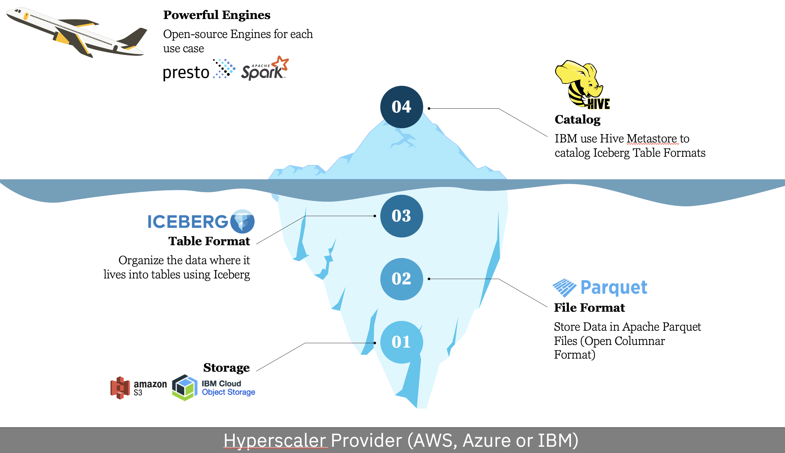

# Fundamentals

Bevor wir mit den Übungen anfangen, möchten wir sicherstellen, dass wir ein gemeinsames Verständnis über die wichtigsten Alleinstellungsmerkmale der Technologie haben. Ein Data Lakehouse (watsonx.data) zeichnet sich durch eine ganze Reihe von Begriffen wie  *"database engine", "catalog", "table format", "file format", "object store", usw.* und wir möchten, dass die Bedeutung, der Umfang, die Abgrenzung und die Varianten von all diesen Begriffen klar wird.

####  1. Das Flugzeug in der Luft (Presto - Mit Engines):
Das Flugzeug, das in der Luft schwebt, repräsentiert Presto. Presto ist eine leistungsstarke Abfrage-Engine, die die Datenverarbeitung ermöglicht. Es verfügt über "Engines" (Motoren), die es ermöglichen, komplexe Abfragen auszuführen und die Daten aus den verschiedenen Ebenen abzurufen.

#### 2. Von oben sieht man nur den Hive Metastore (Eisberg-Spitze):
Von oben betrachtet, über der Oberfläche, sehen Sie nur die Spitze des Eisbergs, die den Hive Metastore repräsentiert. Hive Metastore ist ein Metadatenverwaltungsdienst, der Informationen über die Struktur und den Speicherort Ihrer Daten speichert. Dies ist das sichtbare Element, das Benutzer direkt wahrnehmen.

#### 3. Darunter (Wasserlinie - Iceberg als Table-Format):
Direkt unter der Wasseroberfläche, an der Wasserlinie, befindet sich Iceberg. Iceberg ist ein "Table"-Format, das zur Organisation und Verwaltung von Daten verwendet wird. Ähnlich wie bei einem Eisberg, der aus unterschiedlichen Schichten und Formen bestehen kann, ermöglicht Iceberg die effiziente Organisation und Strukturierung von Daten in verschiedenen Formaten wie Parquet und anderen. Es sorgt dafür, dass Daten zuverlässig und konsistent verwaltet werden.

#### 4. Darunter (Parquet - Einzelne Eisschicht):
Unterhalb von Iceberg befinden sich verschiedene Ebenen von Daten, von denen jede eine einzelne Eisschicht darstellt. Parquet ist ein Beispiel für eine solche Eisschicht. Es handelt sich um ein effizientes Datenformat, das für schnelle und strukturierte Datenverarbeitung verwendet wird. Ähnlich wie bei einem Eisberg, bei dem es unterschiedlich dicke Eisschichten geben kann, können die Daten in verschiedenen Formaten gespeichert sein.

#### 5. Der untere nicht sichtbare Kern (Object Store):
Der unsichtbare, untere Kern des Eisbergs symbolisiert den Object Store. Dies ist ein Datenspeicherdienst, in dem die Daten langfristig und skalierbar gespeichert werden. Es ist der unsichtbare Teil, der die Grundlage für die gesamte Datenspeicherung bildet.

#### 6. Der Boden (Hyperscaler):
Der Boden der Landschaft repräsentiert die Ebene, die nirgendwo sichtbar ist. Dies sind die Hyperscaler wie AWS, Azure oder Google Cloud. Sie stellen die grundlegende Infrastruktur und Ressourcen bereit, die die gesamte Datenverarbeitung unterstützen. Diese Ebene ist für die Benutzer in der Regel nicht direkt relevant, aber sie ermöglicht die Verfügbarkeit und Skalierbarkeit der gesamten Datenverarbeitung.

Fazit: Die Landschaft repräsentiert eine komplexe Datenverarbeitungsumgebung, bei der Presto (das Flugzeug) die Datenverarbeitung ermöglicht. Die Benutzer sehen nur die Spitze des Eisbergs (Hive Metastore), während der Iceberg verschiedene Ebenen (wie Parquet und andere) unterhalb der Wasseroberfläche enthält, um die Daten zu organisieren. Der Object Store bildet die grundlegende Datenspeicherung, und die Hyperscaler (der Boden) stellen die notwendige Infrastruktur bereit, um diese komplexe Datenverarbeitungsumgebung zu unterstützen. Wie bei einem Eisberg können die verschiedenen Schichten unterschiedlich sein, aber sie arbeiten zusammen, um die Daten effizient zu verwalten und zu verarbeiten.

[Fundamentals - PDF Datei](media/p1.pdf)  

Vorschau der Präsentation:

<iframe width="100%" height="800" src="../media/p1.pdf">